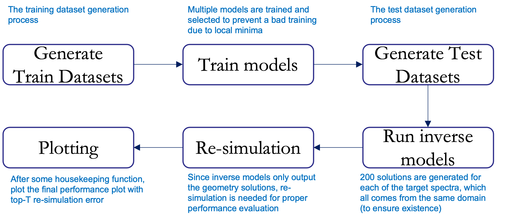
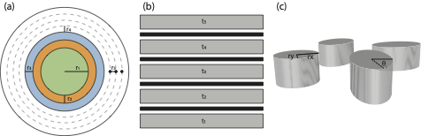
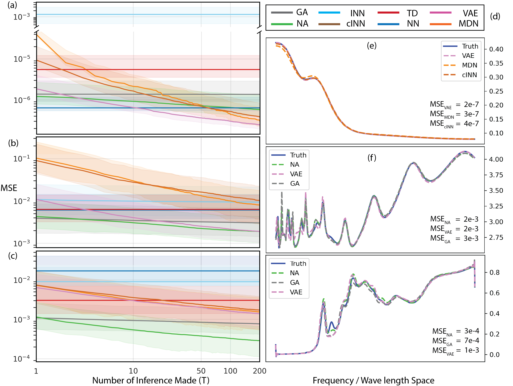
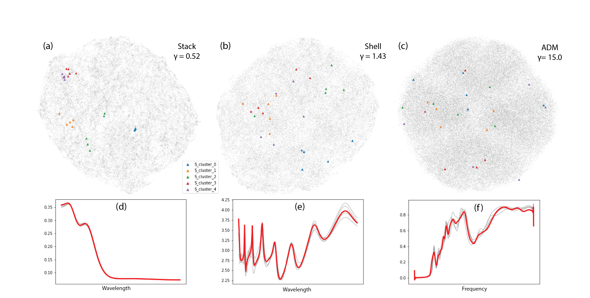

# Inverse deep learning methods and benchmarks for artificial electromagnetic material design

This repository is the implementation of [Inverse deep learning methods and benchmarks for artificial electromagnetic material design](https://arxiv.org/pdf/2112.10254.pdf). Currently under review, by [Simiao Ren*](https://bensonren.github.io/), Ashwin Mahendra*, [Omar Khatib](https://scholar.google.com/citations?user=xPo2CTkAAAAJ&hl=en), [Yang Deng](https://scholar.google.com/citations?hl=en&user=dnh1U0sAAAAJ), [Willie J. Padilla](https://ece.duke.edu/faculty/willie-padilla) and [Jordan Malof](https://ece.duke.edu/faculty/jordan-malof).


## Environment
The detailed conda environment is packaged in [.yml file](./demo/environment.yml).

### Flow chart process
Individual steps are illustrated below. This is laying the roadmap of how you can recreate the result in our paper. The blue fineprint above each step is the functions you should run and please check the detailed illustration below before you run it. 
 

### Folder names
| Folder name | Usage |
|:---------------------------------------------:|:------------------------------------------------------------------:|
| Data |  The folder holding the datasets and the generating code for the benchmarked dataset| 
| NA|  Neural adjoint method (Also contains the code to run neural simulator of ADM dataset)| 
| cINN|  Conditional invertible neural network algorithm| 
| INN_FrEIA|  Invertible neural network| 
| VAE|  Conditional variational autoencoder| 
| MDN| Mixture density network| 
| GA|  Genetic algorithm| 
| Tandem|  Tandem model| 
| inverse|  The direct naive network method (NN)| 
| utils|  helper functions to be called| 

### Generating benchmarking datasets

The schematic of the structure of the datasets are shown below: 

 

The code to generate the benchmarking dataset can be found in [Data](./Data)
 
#### (a) Shell dataset (a.k.a. Peurifoy dataset)
Go to [Data/Peurifoy](./Data/Peurifoy) and run the script to generate dataset
```Generate_Peurifoy
generate_Peurifoy.py
``` 

> Note that the Shell dataset does not use Pytorch but use multiprocessing to accelerate the process. One can change the number of cores to be used by changing 'num_cpu' parameter in '__main__' function of the two scripts.

#### (b) Stack dataset (a.k.a. Chen dataset)
Go to [Data/Chen](./Data/Chen) and run the script to generate dataset
```Generate_chen
generate_chen.py
``` 

#### (c) ADM dataset (a.k.a. Yang_sim / Yang / Deng dataset)
This is a neural simulator that requires a set of neural network weights and model definition files to generate the spectra from random geometry. First download the model weights from [this figshare link.](https://doi.org/10.6084/m9.figshare.17949758.v1) and unzip it under the folder [Data/Yang_sim](./Data/Yang_sim). (so that now there are two folders "sate_dicts", "model_param" and one .py file "generate_mm_x.py" under this folder level)

Then at the same folder level [Data/Yang_sim](./Data/Yang_sim) and run the random generation of the geometry variable
```Generate_geometry_ADM
generate_mm_x.py
```
Then, to get the spectra response of the generated geometries, go to [NA/](./NA/) folder 

```create_mm_dataset
python predict.py  (Make sure you have the one line says creat_mm_dataset activated in this file)
```
> Note that this would require a GPU version of Pytorch since the neural simulator is very slow without a GPU and therefore not supported currently to run on pure CPU configuration

## Training

To train the models in the paper, go to the each folders for algorithms (Except for the Genetic algorithm [GA](./GA)), since they use the exactly same model that NA uses), run this command:

```train
python train.py 
```

> This would read the flags.obj file in the 'models' folder to retrieve the hyper-parameters for each of the
> datasets, afterwhich a training process would be initiated to train a network described in Section 5 of main paper.
> 
> The trained models would be placed in the same 'models' folder with training time and checkpoint file produced.
> Currently the 'models' folders contains the tuned hyper-parameters 
> 
> To counter the stochastic nature of the neural network training process, the training is done 10 times (set up already), after the training the final loss of each training can be seen at parameters.txt of each trained folder at the last entry 'best_validation_loss'. Select the lowest one and rename the folder 'new_best_{Peurifoy, Yang, Chen}'.
> 
> Note that the 'best_validation_loss' is not necessarily MSE loss as the loss function of different algorithm is different, the reason why we can compare is that all trials in single run takes the same hyper-parameters. In real applicaiton one would need to run the (neural) simulator to estimate how good the inverse mdoel is, which is a drawback for some of the models.

> For GA, simply copy the trained best model from [NA/](./NA) and you are all set!

## Generating the test dataset

To ensure the model is evaluated and tested on completely unseen dataset, we need to generate a new test set. Simply save (rename) your current datasets and re-do the previous dataset generation with one line changed in each generation file.

```Comment_the_generation
# ndata = 50000   # Training and validation set
ndata = 1000    # Test set (half would be taken)
```

## Evaluation

To evaluate the models, for each of the algorithms, run this command:
```eval
python evaluate.py
```

> This would run the evaluation for all three datasets currently supported and output the results in the folder 'mm_bench_multi_eval', the sub-level of this folder would be algorithm_name and sub-sub-level would be dataset name.

Some house-keeping work to delete some useless file so that our simulator works, go to [utils/](./utils) and run:

```delete
python delete.py
```

## Re-simulation

Now the prediction and house-keeping is done, however, remember this is a inverse model so the models would only output the proposed geometry solutions. Since we are interested in the re-simulation error, these proposed solutions need to be re-simulated. Again, ADM has slightly different re-simulation path than the other two dataset since it uses neural simulator.

For ADM dataset, go to [NA/predict.py](./NA/predict.py) and de-comment line (also comment the creat_mm_dataset())
```
method_list = ['Tandem','MDN','INN','cINN','VAE','GA','NA','NN']
for method in method_list:
    predict_ensemble_for_all('../Data/Yang_sim/state_dicts/', '../mm_bench_multi_eval/' + method + '/Yang_sim/', no_plot=True)  
```
For Stack and Shell dataset, go to [utils](./utils)
```re-simulation
chen_batch_predict.py
peurifoy_batch_predict.py
```


## Plotting

```plot
python plotsAnalysis.py
```

> One thing to mention is that due to random initialization of weights, local minimums caused by the rough loss surface and stochastic nature of these algorithms, the plot generated is not going to be exactly like the one on the paper. However, with multiple training (mentioned above), the trend is very stable.

## Results

Our model achieves the following performance on :
 

For the detailed example plots on the right panel, you can find the jupyter notebook in utils folder [paper_plot.ipynb](./utils/paper_plot.ipynb)

For the umap plot showing the one-to-manyness of the individual datasets, you can find the jupyter notebook in Data folder[one_to_many.ipynb](./Data/one_to_many.ipynb)

 

### In case one would like to explore the predicted result 
> The file structure of the evaluation at "mm_bench_multi_eval" would be: for each of the algorithm-dataset pair, for all inverse algorithms other than NA and GA: 200 geometry prediction files (with name test_Xpred_new_best_{}inference{}.csv), 200 re-simulated spectra files (with name test_Ypred_new_best_{}inference{}.csv) each have 500 predictions to the 500 differen target spectra. Also the ground truth would be Xtruth.csv and Ytruth.csv.

> For GA and NA, due to implementation issue, they are slightly different. Instead of 200 files each containing 500 different target spectra, GA and NA has 500 files, each corresponding to the same target spectra. (It is like flipping the row and column of a giant prediction matrix.). Therefore, there would be 500 geometry prediction file (with name test_Xpred_pointnew_best_{}inference{}.csv) and 500 re-simulated spectral file. Grouth truth setting is the as above.


## Contributing
If you would like to contribute either method or dataset to this github repo, feel free to raise a issue or make a merge request.

## Credit
For code of algorithms:
1. INN & cINN: We would like to express special thanks to [Visual Learning Lab Heidelberg](https://github.com/VLL-HD) who provided open sourced implementation of their Invertible network structure called Framework for Easily Invertible Architectures [(FrEIA)](https://github.com/VLL-HD/FrEIA) above. Their code base is undergoing non-backward-compatible updates. Therefore to simplify the process we have enclosed their v0.2 code that we used along with our code in this repo. We were inspired a lot from their work and grateful for the implementation of INNs. 

2. MDN: We would also like to express thanks to [Manu Joseph](https://github.com/manujosephv) who published the mixture density network (MDN) implementation that we were greatly inspired from. The implementation of our MDN is adapted from their [Pytorch tabular repo](https://github.com/manujosephv/pytorch_tabular).

For code to generate metamaterial dataset:
1. special thanks to github of [Peurifoy et al.](https://github.com/iguanaus/ScatterNet) from their paper [Nanophotonic particle simulation and inverse design using artificial neural networks](10.1126/sciadv.aar4206) for providing the Shell dataset 
2. special thanks to github of [Chen et al.](https://github.com/closest-git/MetaLab) from their paper [Smart inverse design of graphene-based photonic metamaterials by an adaptive artificial neural network](10.1039/c9nr01315f) for providing the Stack dataset.
3. special thanks to github of [Ren et al.](https://github.com/BensonRen/BDIMNNA) from their paper [Benchmarking deep inverse models over time, and the neural-adjoint method](https://proceedings.neurips.cc/paper/2020/hash/007ff380ee5ac49ffc34442f5c2a2b86-Abstract.html) for providing the ADM dataset

## License

The project is licensed under the MIT license.

Please cite this work if some of the code or datasets are helpful in your scientific endeavours. For specific datasets, please also cite the respective original source(s), given in the preprint.